```python
import os
import re
import sys
import glob
import numpy as np
import cv2
import matplotlib.pyplot as plt

from PyQt5.QtWidgets import (
    QApplication, QWidget, QLabel, QLineEdit, QPushButton,
    QMessageBox, QSlider, QVBoxLayout
)
from PyQt5.QtCore import Qt

from ultralytics import YOLO


# ---------------------------
# YOLOv5-based counter
# ---------------------------

class YOLOv5ObjectCounter:
    """
    YOLOv5 object detector using ultralytics.
    Provides count_objects() and density_map() compatible with old CounTR stub.
    """
    def __init__(self, model_path="yolov5s.pt"):
        # Loads COCO-pretrained YOLOv5s (auto-download on first run)
        self.model = YOLO(model_path)

   

    def _run(self, image_bgr):
        img_rgb = cv2.cvtColor(image_bgr, cv2.COLOR_BGR2RGB)
        results = self.model(
        img_rgb,
        conf=0.05,       # even lower for higher recall
        iou=0.5,         # slightly higher NMS IoU
        imgsz=1024,      # more pixels per berry
        max_det=300,     # allow many berries
        agnostic_nms=True
        )
        return results[0]


    def count_objects(self, image_bgr):
        r = self._run(image_bgr)
        return float(len(r.boxes))   # number of detections

    def density_map(self, image_bgr):
        h, w = image_bgr.shape[:2]
        heat = np.zeros((h, w), dtype=np.float32)

        r = self._run(image_bgr)
        if r.boxes is None or len(r.boxes) == 0:
            return heat

        boxes = r.boxes.xyxy.cpu().numpy()  # (N,4): x1,y1,x2,y2
        for x1, y1, x2, y2 in boxes:
            x1, y1, x2, y2 = map(int, [x1, y1, x2, y2])
            x1 = max(0, min(w - 1, x1))
            x2 = max(0, min(w, x2))
            y1 = max(0, min(h - 1, y1))
            y2 = max(0, min(h, y2))
            heat[y1:y2, x1:x2] += 1.0

        if heat.max() > 0:
            heat /= heat.max()
        return heat.astype(np.float32)


# ---------------------------
# Overlay helpers
# ---------------------------

def anomaly_map_overlay(image, density_map, blend="equal"):
    norm_map = cv2.normalize(density_map, None, 0, 255, cv2.NORM_MINMAX).astype("uint8")
    heatmap = cv2.applyColorMap(norm_map, cv2.COLORMAP_JET)
    alpha = 0.5 if blend == "equal" else 0.7
    overlay = cv2.addWeighted(image, 1 - alpha, heatmap, alpha, 0)
    return overlay


def overlay_density_map(image, density_map, count):
    over = anomaly_map_overlay(image, density_map, blend="equal")
    h, w = over.shape[:2]
    font_scale = max(min(w // 30, 200) / 30.0, 0.5)
    text = f"count={count:.2f}"
    (tw, th), _ = cv2.getTextSize(text, cv2.FONT_HERSHEY_SIMPLEX, font_scale, 2)
    x = max(w - (tw + 20), 5)
    y = max(th + 10, 20)
    cv2.putText(
        over, text, (x, y),
        cv2.FONT_HERSHEY_SIMPLEX, font_scale,
        (255, 255, 255), 2, cv2.LINE_AA
    )
    return over


# ---------------------------
# Core search & GUI logic
# ---------------------------

class FruitSearchApp(QWidget):
    def __init__(self, data_dir):
        super().__init__()
        self.data_dir = data_dir
        self.filtered_files = []
        self.counts = []
        self.density_maps = []

        self.init_ui()

    def init_ui(self):
        self.setWindowTitle("Fruit Search (YOLOv5)")
        self.setGeometry(100, 100, 500, 200)

        self.label = QLabel(
            'Enter a pattern to search for (e.g., "blueberry", "kiwis", "apple", "cherry","strawberry"):',
            self
        )
        self.edit = QLineEdit(self)
        self.button = QPushButton("Search", self)
        self.button.clicked.connect(self.search_images)

        self.slider = QSlider(Qt.Horizontal, self)
        self.slider.valueChanged.connect(self.update_image)
        self.slider.setMinimum(1)
        self.slider.setEnabled(False)

        self.index_label = QLabel("", self)

        layout = QVBoxLayout()
        layout.addWidget(self.label)
        layout.addWidget(self.edit)
        layout.addWidget(self.button)
        layout.addWidget(self.slider)
        layout.addWidget(self.index_label)

        self.setLayout(layout)

    def search_images(self):
        user_pattern = self.edit.text().strip()
        if not user_pattern:
            QMessageBox.warning(self, "Input Error", "Please enter a pattern.")
            return

        regex = re.compile(rf"\w*{re.escape(user_pattern)}\w*", re.IGNORECASE)
        all_files = glob.glob(os.path.join(self.data_dir, "**", "*.*"), recursive=True)

        self.filtered_files = [
            f for f in all_files
            if regex.search(os.path.basename(f)) and not re.search(r"json", f, re.IGNORECASE)
        ]

        QMessageBox.information(
            self,
            "Search Result",
            f"Found {len(self.filtered_files)} images containing {user_pattern}."
        )

        if not self.filtered_files:
            return

        # Show montage of up to 15 images
        self.show_montage(self.filtered_files[:15], user_pattern)

        # First image as reference
        exemplar_image_path = self.filtered_files[0]
        I = cv2.imread(exemplar_image_path)
        if I is None:
            QMessageBox.warning(self, "Error", "Failed to read exemplar image.")
            return
        I = cv2.resize(I, (512, 512))

        # Initialize YOLOv5 counter (no exemplar boxes needed)
        counter = YOLOv5ObjectCounter()

        # Single-image count + density
        count = counter.count_objects(I)
        density_map = counter.density_map(I)
        QMessageBox.information(
            self,
            "Number of fruits detected",
            f"Number of objects detected: {count:.3f}"
        )

        # Show density map
        plt.figure("DensityMap")
        plt.imshow(density_map, cmap="jet")
        plt.axis("off")
        plt.show(block=False)

        # Overlay density + count text
        overlay = overlay_density_map(I, density_map, count)
        plt.figure("DensityOverlay")
        plt.imshow(cv2.cvtColor(overlay, cv2.COLOR_BGR2RGB))
        plt.axis("off")
        plt.show(block=False)

        # Montage of original, overlay, normalized density
        norm_dm = cv2.normalize(density_map, None, 0, 1, cv2.NORM_MINMAX)
        fig, axes = plt.subplots(1, 3, num="DensityOverlayannotated")
        axes[0].imshow(cv2.cvtColor(I, cv2.COLOR_BGR2RGB))
        axes[0].set_title("Original")
        axes[1].imshow(cv2.cvtColor(overlay, cv2.COLOR_BGR2RGB))
        axes[1].set_title("Overlay")
        axes[2].imshow(norm_dm, cmap="jet")
        axes[2].set_title("Density")
        for ax in axes:
            ax.axis("off")
        plt.show(block=False)

        # Batch counts over all filtered images
        self.counts = []
        self.density_maps = []
        for p in self.filtered_files:
            img = cv2.imread(p)
            if img is None:
                self.counts.append(0.0)
                self.density_maps.append(None)
                continue
            c = counter.count_objects(img)
            dm = counter.density_map(img)
            self.counts.append(c)
            self.density_maps.append(dm)

        # Scatter plot of counts
        plt.figure("FilteredCounts")
        plt.scatter(range(1, len(self.filtered_files) + 1), self.counts)
        plt.xlabel("Image index")
        plt.ylabel("Count")
        plt.show(block=False)

        # Slider to browse overlays
        self.slider.setMaximum(len(self.filtered_files))
        self.slider.setValue(1)
        self.slider.setEnabled(True)
        self.update_image(1)

    def show_montage(self, file_list, pattern):
        imgs = []
        for fp in file_list:
            img = cv2.imread(fp)
            if img is None:
                continue
            img = cv2.resize(img, (500, 500))
            img = cv2.cvtColor(img, cv2.COLOR_BGR2RGB)
            imgs.append(img)

        n = len(imgs)
        if n == 0:
            return
        cols = min(5, n)
        rows = int(np.ceil(n / cols))

        fig, axes = plt.subplots(rows, cols, figsize=(15, 3 * rows), num="Image Montage")
        axes = np.array(axes).reshape(-1)
        for ax in axes:
            ax.axis("off")

        for i, img in enumerate(imgs):
            axes[i].imshow(img)
            axes[i].axis("off")

        fig.suptitle(f"Montage of up to {n} images containing '{pattern}'")
        plt.tight_layout()
        plt.show(block=False)

    def update_image(self, index):
        if not self.filtered_files or not self.density_maps:
            return
        idx = int(index) - 1
        idx = max(0, min(idx, len(self.filtered_files) - 1))

        img = cv2.imread(self.filtered_files[idx])
        if img is None:
            return
        dm = self.density_maps[idx]
        c = self.counts[idx]

        if dm is None:
            overlay = img
        else:
            overlay = overlay_density_map(img, dm, c)

        plt.figure("imageIdx")
        plt.clf()
        plt.imshow(cv2.cvtColor(overlay, cv2.COLOR_BGR2RGB))
        plt.axis("off")
        plt.draw()
        plt.pause(0.001)

        self.index_label.setText(f"Image {idx + 1} of {len(self.filtered_files)}")


def main():
    # assumes "FruitDetectionDataset" folder is in current working directory
    data_dir = os.path.join(os.getcwd(), "FruitDetectionDataset")
    if not os.path.isdir(data_dir):
        print(f"Dataset folder not found at: {data_dir}")
        sys.exit(1)

    app = QApplication(sys.argv)
    w = FruitSearchApp(data_dir)
    w.show()
    sys.exit(app.exec_())


if __name__ == "__main__":
    main()

```


    
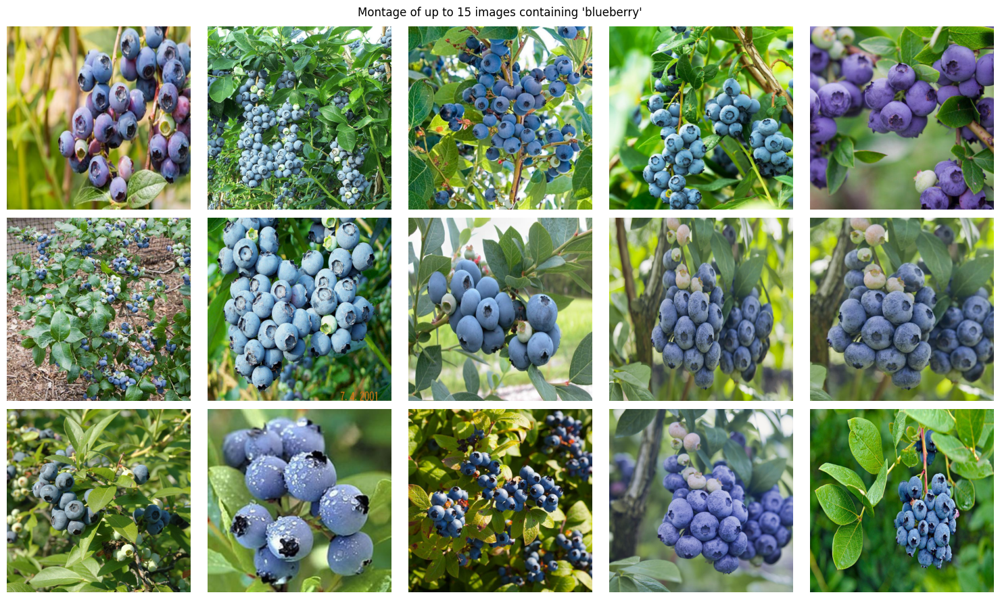
    


    PRO TIP 💡 Replace 'model=yolov5s.pt' with new 'model=yolov5su.pt'.
    YOLOv5 'u' models are trained with https://github.com/ultralytics/ultralytics and feature improved performance vs standard YOLOv5 models trained with https://github.com/ultralytics/yolov5.
    
    
    0: 1024x1024 8 persons, 3 birds, 1 dog, 1 sheep, 1 frisbee, 1 sports ball, 1 banana, 8 apples, 1039.8ms
    Speed: 8.2ms preprocess, 1039.8ms inference, 11.4ms postprocess per image at shape (1, 3, 1024, 1024)
    
    0: 1024x1024 8 persons, 3 birds, 1 dog, 1 sheep, 1 frisbee, 1 sports ball, 1 banana, 8 apples, 990.1ms
    Speed: 5.7ms preprocess, 990.1ms inference, 5.1ms postprocess per image at shape (1, 3, 1024, 1024)


    
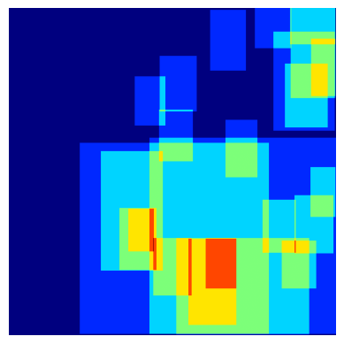
    


    
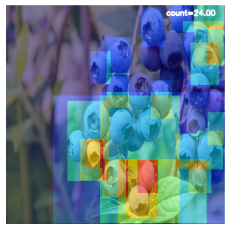
    


    
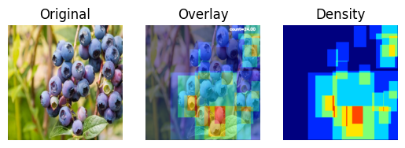
    


    
    0: 704x1024 1 person, 1 bird, 1 sports ball, 21 apples, 3 oranges, 744.4ms
    Speed: 22.4ms preprocess, 744.4ms inference, 15.5ms postprocess per image at shape (1, 3, 704, 1024)
    
    0: 704x1024 1 person, 1 bird, 1 sports ball, 21 apples, 3 oranges, 661.7ms
    Speed: 3.2ms preprocess, 661.7ms inference, 2.6ms postprocess per image at shape (1, 3, 704, 1024)
    
    0: 1024x1024 8 apples, 9 oranges, 1 teddy bear, 984.1ms
    Speed: 5.6ms preprocess, 984.1ms inference, 2.6ms postprocess per image at shape (1, 3, 1024, 1024)
    
    0: 1024x1024 8 apples, 9 oranges, 1 teddy bear, 1532.8ms
    Speed: 4.2ms preprocess, 1532.8ms inference, 6.6ms postprocess per image at shape (1, 3, 1024, 1024)
    
    0: 1024x1024 1 person, 2 umbrellas, 27 apples, 14 oranges, 1 teddy bear, 1162.4ms
    Speed: 7.3ms preprocess, 1162.4ms inference, 4.4ms postprocess per image at shape (1, 3, 1024, 1024)
    
    0: 1024x1024 1 person, 2 umbrellas, 27 apples, 14 oranges, 1 teddy bear, 950.8ms
    Speed: 5.4ms preprocess, 950.8ms inference, 6.6ms postprocess per image at shape (1, 3, 1024, 1024)
    
    0: 1024x1024 4 birds, 7 bananas, 13 apples, 2 oranges, 1 donut, 1 teddy bear, 931.6ms
    Speed: 5.4ms preprocess, 931.6ms inference, 3.0ms postprocess per image at shape (1, 3, 1024, 1024)
    
    0: 1024x1024 4 birds, 7 bananas, 13 apples, 2 oranges, 1 donut, 1 teddy bear, 924.9ms
    Speed: 4.8ms preprocess, 924.9ms inference, 4.8ms postprocess per image at shape (1, 3, 1024, 1024)
    
    0: 1024x1024 1 banana, 21 apples, 1 orange, 2 teddy bears, 930.4ms
    Speed: 4.0ms preprocess, 930.4ms inference, 3.1ms postprocess per image at shape (1, 3, 1024, 1024)
    
    0: 1024x1024 1 banana, 21 apples, 1 orange, 2 teddy bears, 918.7ms
    Speed: 4.3ms preprocess, 918.7ms inference, 2.6ms postprocess per image at shape (1, 3, 1024, 1024)
    
    0: 1024x1024 58 apples, 19 oranges, 3 broccolis, 935.9ms
    Speed: 4.8ms preprocess, 935.9ms inference, 6.4ms postprocess per image at shape (1, 3, 1024, 1024)
    
    0: 1024x1024 58 apples, 19 oranges, 3 broccolis, 937.9ms
    Speed: 4.2ms preprocess, 937.9ms inference, 6.2ms postprocess per image at shape (1, 3, 1024, 1024)
    
    0: 832x1024 9 bananas, 3 apples, 4 oranges, 7 teddy bears, 753.4ms
    Speed: 4.8ms preprocess, 753.4ms inference, 2.6ms postprocess per image at shape (1, 3, 832, 1024)
    
    0: 832x1024 9 bananas, 3 apples, 4 oranges, 7 teddy bears, 760.6ms
    Speed: 4.5ms preprocess, 760.6ms inference, 2.5ms postprocess per image at shape (1, 3, 832, 1024)
    
    0: 736x1024 2 apples, 13 oranges, 671.1ms
    Speed: 3.6ms preprocess, 671.1ms inference, 4.4ms postprocess per image at shape (1, 3, 736, 1024)
    
    0: 736x1024 2 apples, 13 oranges, 658.1ms
    Speed: 3.4ms preprocess, 658.1ms inference, 1.8ms postprocess per image at shape (1, 3, 736, 1024)
    
    0: 704x1024 29 apples, 2 oranges, 632.3ms
    Speed: 3.9ms preprocess, 632.3ms inference, 3.7ms postprocess per image at shape (1, 3, 704, 1024)
    
    0: 704x1024 29 apples, 2 oranges, 632.1ms
    Speed: 3.8ms preprocess, 632.1ms inference, 4.8ms postprocess per image at shape (1, 3, 704, 1024)
    
    0: 1024x1024 1 bird, 1 bowl, 1 banana, 13 apples, 10 oranges, 2 carrots, 1 vase, 941.8ms
    Speed: 4.1ms preprocess, 941.8ms inference, 4.2ms postprocess per image at shape (1, 3, 1024, 1024)
    
    0: 1024x1024 1 bird, 1 bowl, 1 banana, 13 apples, 10 oranges, 2 carrots, 1 vase, 931.4ms
    Speed: 3.5ms preprocess, 931.4ms inference, 3.8ms postprocess per image at shape (1, 3, 1024, 1024)
    
    0: 1024x1024 1 umbrella, 10 apples, 1 orange, 1 teddy bear, 932.0ms
    Speed: 4.3ms preprocess, 932.0ms inference, 2.5ms postprocess per image at shape (1, 3, 1024, 1024)
    
    0: 1024x1024 1 umbrella, 10 apples, 1 orange, 1 teddy bear, 936.7ms
    Speed: 4.3ms preprocess, 936.7ms inference, 2.2ms postprocess per image at shape (1, 3, 1024, 1024)
    
    0: 1024x1024 1 bird, 1 orange, 5 donuts, 1 vase, 1 teddy bear, 936.7ms
    Speed: 3.4ms preprocess, 936.7ms inference, 2.2ms postprocess per image at shape (1, 3, 1024, 1024)
    
    0: 1024x1024 1 bird, 1 orange, 5 donuts, 1 vase, 1 teddy bear, 947.2ms
    Speed: 4.6ms preprocess, 947.2ms inference, 2.2ms postprocess per image at shape (1, 3, 1024, 1024)
    
    0: 1024x1024 11 persons, 1 umbrella, 3 apples, 4 oranges, 2 chairs, 10 teddy bears, 973.3ms
    Speed: 6.2ms preprocess, 973.3ms inference, 5.4ms postprocess per image at shape (1, 3, 1024, 1024)
    
    0: 1024x1024 11 persons, 1 umbrella, 3 apples, 4 oranges, 2 chairs, 10 teddy bears, 951.6ms
    Speed: 4.1ms preprocess, 951.6ms inference, 5.3ms postprocess per image at shape (1, 3, 1024, 1024)
    
    0: 1024x1024 2 persons, 2 umbrellas, 2 bananas, 32 apples, 1 orange, 959.4ms
    Speed: 4.5ms preprocess, 959.4ms inference, 5.0ms postprocess per image at shape (1, 3, 1024, 1024)
    
    0: 1024x1024 2 persons, 2 umbrellas, 2 bananas, 32 apples, 1 orange, 955.1ms
    Speed: 5.8ms preprocess, 955.1ms inference, 5.2ms postprocess per image at shape (1, 3, 1024, 1024)
    
    0: 672x1024 1 bird, 3 oranges, 5 donuts, 1 vase, 4 teddy bears, 636.0ms
    Speed: 3.3ms preprocess, 636.0ms inference, 1.7ms postprocess per image at shape (1, 3, 672, 1024)
    
    0: 672x1024 1 bird, 3 oranges, 5 donuts, 1 vase, 4 teddy bears, 641.0ms
    Speed: 2.9ms preprocess, 641.0ms inference, 3.4ms postprocess per image at shape (1, 3, 672, 1024)
    
    0: 1024x736 36 apples, 15 oranges, 1 dining table, 1 teddy bear, 697.3ms
    Speed: 4.2ms preprocess, 697.3ms inference, 5.4ms postprocess per image at shape (1, 3, 1024, 736)
    
    0: 1024x736 36 apples, 15 oranges, 1 dining table, 1 teddy bear, 703.8ms
    Speed: 3.2ms preprocess, 703.8ms inference, 4.4ms postprocess per image at shape (1, 3, 1024, 736)
    
    0: 864x1024 21 apples, 30 oranges, 3 carrots, 1 teddy bear, 812.5ms
    Speed: 3.1ms preprocess, 812.5ms inference, 5.5ms postprocess per image at shape (1, 3, 864, 1024)
    
    0: 864x1024 21 apples, 30 oranges, 3 carrots, 1 teddy bear, 880.6ms
    Speed: 4.9ms preprocess, 880.6ms inference, 4.3ms postprocess per image at shape (1, 3, 864, 1024)
    
    0: 1024x992 4 birds, 2 bananas, 6 apples, 1 orange, 4 teddy bears, 951.5ms
    Speed: 5.5ms preprocess, 951.5ms inference, 2.3ms postprocess per image at shape (1, 3, 1024, 992)
    
    0: 1024x992 4 birds, 2 bananas, 6 apples, 1 orange, 4 teddy bears, 944.0ms
    Speed: 4.2ms preprocess, 944.0ms inference, 4.5ms postprocess per image at shape (1, 3, 1024, 992)
    
    0: 704x1024 1 bird, 1 apple, 1 orange, 8 donuts, 1 vase, 3 teddy bears, 691.9ms
    Speed: 4.1ms preprocess, 691.9ms inference, 3.2ms postprocess per image at shape (1, 3, 704, 1024)
    
    0: 704x1024 1 bird, 1 apple, 1 orange, 8 donuts, 1 vase, 3 teddy bears, 684.5ms
    Speed: 3.1ms preprocess, 684.5ms inference, 1.8ms postprocess per image at shape (1, 3, 704, 1024)
    
    0: 1024x1024 3 persons, 1 bowl, 3 bananas, 6 apples, 2 oranges, 995.1ms
    Speed: 5.3ms preprocess, 995.1ms inference, 2.2ms postprocess per image at shape (1, 3, 1024, 1024)
    
    0: 1024x1024 3 persons, 1 bowl, 3 bananas, 6 apples, 2 oranges, 1004.3ms
    Speed: 4.2ms preprocess, 1004.3ms inference, 2.4ms postprocess per image at shape (1, 3, 1024, 1024)
    
    0: 1024x1024 1 person, 4 birds, 3 bananas, 3 apples, 6 oranges, 1 broccoli, 3 teddy bears, 1014.3ms
    Speed: 4.5ms preprocess, 1014.3ms inference, 4.6ms postprocess per image at shape (1, 3, 1024, 1024)
    
    0: 1024x1024 1 person, 4 birds, 3 bananas, 3 apples, 6 oranges, 1 broccoli, 3 teddy bears, 999.5ms
    Speed: 3.8ms preprocess, 999.5ms inference, 3.8ms postprocess per image at shape (1, 3, 1024, 1024)
    
    0: 800x1024 2 birds, 6 apples, 2 oranges, 815.6ms
    Speed: 4.8ms preprocess, 815.6ms inference, 1.9ms postprocess per image at shape (1, 3, 800, 1024)
    
    0: 800x1024 2 birds, 6 apples, 2 oranges, 787.8ms
    Speed: 5.9ms preprocess, 787.8ms inference, 2.4ms postprocess per image at shape (1, 3, 800, 1024)
    
    0: 1024x1024 4 persons, 1 bird, 11 apples, 5 oranges, 1 broccoli, 9 teddy bears, 1011.2ms
    Speed: 3.7ms preprocess, 1011.2ms inference, 5.9ms postprocess per image at shape (1, 3, 1024, 1024)
    
    0: 1024x1024 4 persons, 1 bird, 11 apples, 5 oranges, 1 broccoli, 9 teddy bears, 1023.6ms
    Speed: 4.1ms preprocess, 1023.6ms inference, 4.8ms postprocess per image at shape (1, 3, 1024, 1024)


    
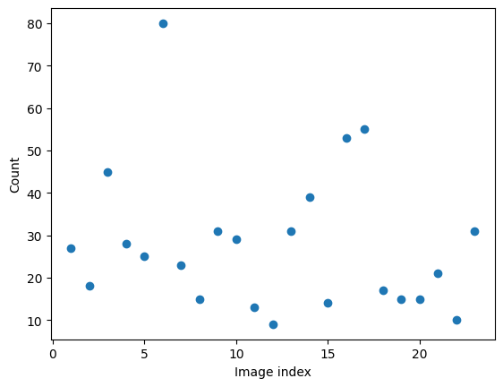
    


    
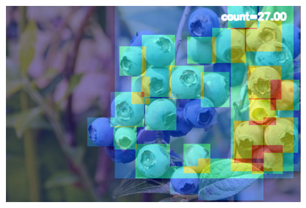
    


    
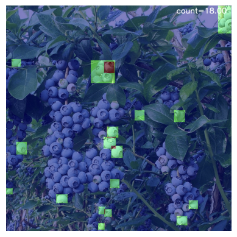
    


    
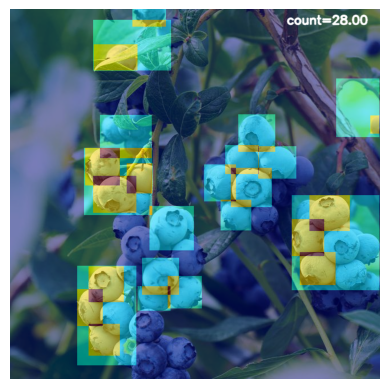
    


    
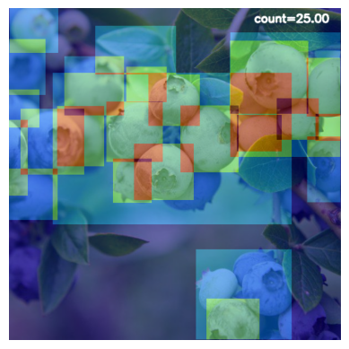
    


    
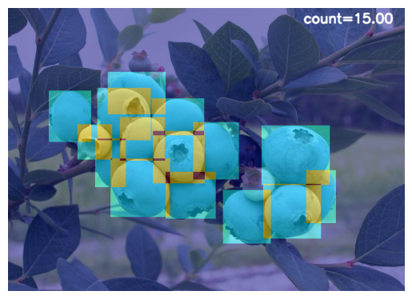
    


    
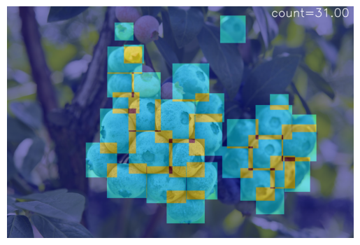
    


    
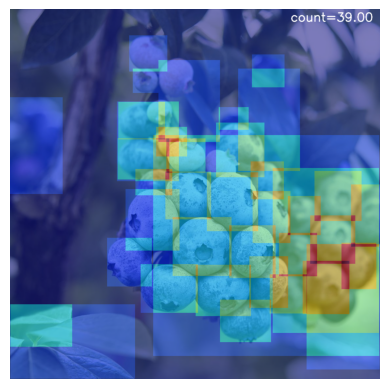
    


    
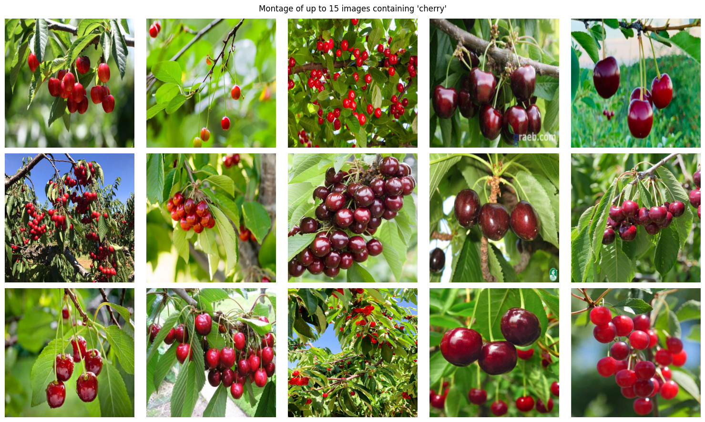
    


    PRO TIP 💡 Replace 'model=yolov5s.pt' with new 'model=yolov5su.pt'.
    YOLOv5 'u' models are trained with https://github.com/ultralytics/ultralytics and feature improved performance vs standard YOLOv5 models trained with https://github.com/ultralytics/yolov5.
    
    
    0: 1024x1024 1 apple, 1024.0ms
    Speed: 6.7ms preprocess, 1024.0ms inference, 9.7ms postprocess per image at shape (1, 3, 1024, 1024)
    
    0: 1024x1024 1 apple, 958.8ms
    Speed: 3.7ms preprocess, 958.8ms inference, 1.7ms postprocess per image at shape (1, 3, 1024, 1024)


    
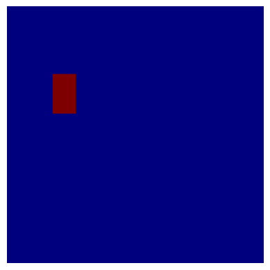
    


    
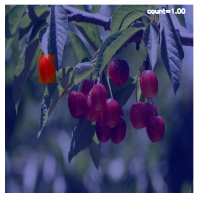
    


    
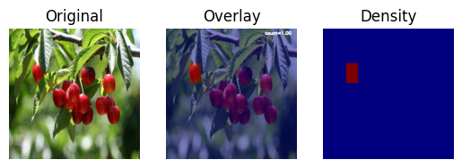
    


    
    0: 704x1024 3 apples, 1 potted plant, 712.7ms
    Speed: 11.9ms preprocess, 712.7ms inference, 2.4ms postprocess per image at shape (1, 3, 704, 1024)
    
    0: 704x1024 3 apples, 1 potted plant, 663.1ms
    Speed: 3.1ms preprocess, 663.1ms inference, 2.5ms postprocess per image at shape (1, 3, 704, 1024)
    
    0: 640x1024 1 car, 2 birds, 2 sports balls, 1 apple, 617.3ms
    Speed: 3.8ms preprocess, 617.3ms inference, 4.0ms postprocess per image at shape (1, 3, 640, 1024)
    
    0: 640x1024 1 car, 2 birds, 2 sports balls, 1 apple, 574.9ms
    Speed: 3.1ms preprocess, 574.9ms inference, 1.2ms postprocess per image at shape (1, 3, 640, 1024)
    
    0: 704x1024 31 apples, 1 orange, 646.1ms
    Speed: 3.3ms preprocess, 646.1ms inference, 2.7ms postprocess per image at shape (1, 3, 704, 1024)
    
    0: 704x1024 31 apples, 1 orange, 634.7ms
    Speed: 2.6ms preprocess, 634.7ms inference, 3.7ms postprocess per image at shape (1, 3, 704, 1024)
    
    0: 672x1024 1 bird, 2 apples, 1 teddy bear, 605.5ms
    Speed: 2.3ms preprocess, 605.5ms inference, 2.0ms postprocess per image at shape (1, 3, 672, 1024)
    
    0: 672x1024 1 bird, 2 apples, 1 teddy bear, 631.3ms
    Speed: 2.6ms preprocess, 631.3ms inference, 2.6ms postprocess per image at shape (1, 3, 672, 1024)
    
    0: 608x1024 1 car, 1 umbrella, 4 apples, 590.8ms
    Speed: 4.1ms preprocess, 590.8ms inference, 3.2ms postprocess per image at shape (1, 3, 608, 1024)
    
    0: 608x1024 1 car, 1 umbrella, 4 apples, 560.3ms
    Speed: 2.4ms preprocess, 560.3ms inference, 2.6ms postprocess per image at shape (1, 3, 608, 1024)
    
    0: 768x1024 1 bird, 737.0ms
    Speed: 2.5ms preprocess, 737.0ms inference, 3.7ms postprocess per image at shape (1, 3, 768, 1024)
    
    0: 768x1024 1 bird, 716.2ms
    Speed: 2.3ms preprocess, 716.2ms inference, 1.6ms postprocess per image at shape (1, 3, 768, 1024)
    
    0: 768x1024 1 apple, 784.3ms
    Speed: 4.0ms preprocess, 784.3ms inference, 1.7ms postprocess per image at shape (1, 3, 768, 1024)
    
    0: 768x1024 1 apple, 866.9ms
    Speed: 4.5ms preprocess, 866.9ms inference, 3.7ms postprocess per image at shape (1, 3, 768, 1024)
    
    0: 1024x1024 1 motorcycle, 11 apples, 1 bed, 1 dining table, 4 vases, 1 teddy bear, 1229.8ms
    Speed: 14.3ms preprocess, 1229.8ms inference, 8.8ms postprocess per image at shape (1, 3, 1024, 1024)
    
    0: 1024x1024 1 motorcycle, 11 apples, 1 bed, 1 dining table, 4 vases, 1 teddy bear, 1018.3ms
    Speed: 5.8ms preprocess, 1018.3ms inference, 4.1ms postprocess per image at shape (1, 3, 1024, 1024)
    
    0: 768x1024 1 dog, 1 bottle, 2 bowls, 3 apples, 737.9ms
    Speed: 3.2ms preprocess, 737.9ms inference, 2.7ms postprocess per image at shape (1, 3, 768, 1024)
    
    0: 768x1024 1 dog, 1 bottle, 2 bowls, 3 apples, 730.4ms
    Speed: 3.7ms preprocess, 730.4ms inference, 3.3ms postprocess per image at shape (1, 3, 768, 1024)
    
    0: 1024x1024 1 banana, 10 apples, 969.2ms
    Speed: 4.8ms preprocess, 969.2ms inference, 2.7ms postprocess per image at shape (1, 3, 1024, 1024)
    
    0: 1024x1024 1 banana, 10 apples, 969.6ms
    Speed: 4.4ms preprocess, 969.6ms inference, 2.1ms postprocess per image at shape (1, 3, 1024, 1024)
    
    0: 704x1024 1 person, 1 bicycle, 2 birds, 4 vases, 1 teddy bear, 668.5ms
    Speed: 2.8ms preprocess, 668.5ms inference, 1.5ms postprocess per image at shape (1, 3, 704, 1024)
    
    0: 704x1024 1 person, 1 bicycle, 2 birds, 4 vases, 1 teddy bear, 658.2ms
    Speed: 2.7ms preprocess, 658.2ms inference, 1.5ms postprocess per image at shape (1, 3, 704, 1024)
    
    0: 768x1024 1 bicycle, 16 apples, 1 potted plant, 739.8ms
    Speed: 3.0ms preprocess, 739.8ms inference, 3.5ms postprocess per image at shape (1, 3, 768, 1024)
    
    0: 768x1024 1 bicycle, 16 apples, 1 potted plant, 749.1ms
    Speed: 2.6ms preprocess, 749.1ms inference, 2.6ms postprocess per image at shape (1, 3, 768, 1024)
    
    0: 1024x768 3 apples, 734.5ms
    Speed: 4.6ms preprocess, 734.5ms inference, 1.5ms postprocess per image at shape (1, 3, 1024, 768)
    
    0: 1024x768 3 apples, 751.5ms
    Speed: 3.3ms preprocess, 751.5ms inference, 3.4ms postprocess per image at shape (1, 3, 1024, 768)
    
    0: 1024x1024 1 cup, 1 bowl, 11 apples, 1 vase, 1029.0ms
    Speed: 4.2ms preprocess, 1029.0ms inference, 2.4ms postprocess per image at shape (1, 3, 1024, 1024)
    
    0: 1024x1024 1 cup, 1 bowl, 11 apples, 1 vase, 1003.4ms
    Speed: 3.8ms preprocess, 1003.4ms inference, 2.2ms postprocess per image at shape (1, 3, 1024, 1024)
    
    0: 1024x1024 1 bird, 1 cup, 1 spoon, 5 apples, 2 oranges, 2 vases, 1012.7ms
    Speed: 5.2ms preprocess, 1012.7ms inference, 2.9ms postprocess per image at shape (1, 3, 1024, 1024)
    
    0: 1024x1024 1 bird, 1 cup, 1 spoon, 5 apples, 2 oranges, 2 vases, 1022.4ms
    Speed: 4.1ms preprocess, 1022.4ms inference, 3.0ms postprocess per image at shape (1, 3, 1024, 1024)
    
    0: 704x1024 6 apples, 719.1ms
    Speed: 4.0ms preprocess, 719.1ms inference, 3.0ms postprocess per image at shape (1, 3, 704, 1024)
    
    0: 704x1024 6 apples, 699.9ms
    Speed: 3.1ms preprocess, 699.9ms inference, 1.7ms postprocess per image at shape (1, 3, 704, 1024)
    
    0: 832x1024 3 apples, 1 toothbrush, 813.3ms
    Speed: 5.8ms preprocess, 813.3ms inference, 2.0ms postprocess per image at shape (1, 3, 832, 1024)
    
    0: 832x1024 3 apples, 1 toothbrush, 869.3ms
    Speed: 6.7ms preprocess, 869.3ms inference, 6.9ms postprocess per image at shape (1, 3, 832, 1024)
    
    0: 1024x832 17 apples, 1037.3ms
    Speed: 4.2ms preprocess, 1037.3ms inference, 4.4ms postprocess per image at shape (1, 3, 1024, 832)
    
    0: 1024x832 17 apples, 833.2ms
    Speed: 4.6ms preprocess, 833.2ms inference, 4.2ms postprocess per image at shape (1, 3, 1024, 832)
    
    0: 768x1024 3 apples, 1 potted plant, 792.7ms
    Speed: 3.0ms preprocess, 792.7ms inference, 1.8ms postprocess per image at shape (1, 3, 768, 1024)
    
    0: 768x1024 3 apples, 1 potted plant, 780.4ms
    Speed: 2.9ms preprocess, 780.4ms inference, 1.4ms postprocess per image at shape (1, 3, 768, 1024)
    
    0: 1024x1024 3 cars, 1 bird, 9 apples, 1 vase, 1046.1ms
    Speed: 4.1ms preprocess, 1046.1ms inference, 2.1ms postprocess per image at shape (1, 3, 1024, 1024)
    
    0: 1024x1024 3 cars, 1 bird, 9 apples, 1 vase, 1051.4ms
    Speed: 3.9ms preprocess, 1051.4ms inference, 2.2ms postprocess per image at shape (1, 3, 1024, 1024)
    
    0: 1024x672 6 apples, 685.9ms
    Speed: 4.2ms preprocess, 685.9ms inference, 1.7ms postprocess per image at shape (1, 3, 1024, 672)
    
    0: 1024x672 6 apples, 688.3ms
    Speed: 3.9ms preprocess, 688.3ms inference, 1.4ms postprocess per image at shape (1, 3, 1024, 672)
    
    0: 704x1024 1 person, 1 vase, 696.7ms
    Speed: 3.5ms preprocess, 696.7ms inference, 2.5ms postprocess per image at shape (1, 3, 704, 1024)
    
    0: 704x1024 1 person, 1 vase, 716.7ms
    Speed: 4.8ms preprocess, 716.7ms inference, 3.0ms postprocess per image at shape (1, 3, 704, 1024)
    
    0: 1024x768 26 apples, 8 oranges, 1 potted plant, 800.4ms
    Speed: 5.7ms preprocess, 800.4ms inference, 3.9ms postprocess per image at shape (1, 3, 1024, 768)
    
    0: 1024x768 26 apples, 8 oranges, 1 potted plant, 880.3ms
    Speed: 5.3ms preprocess, 880.3ms inference, 6.1ms postprocess per image at shape (1, 3, 1024, 768)
    
    0: 704x1024 1 traffic light, 10 apples, 3 oranges, 745.4ms
    Speed: 3.5ms preprocess, 745.4ms inference, 2.0ms postprocess per image at shape (1, 3, 704, 1024)
    
    0: 704x1024 1 traffic light, 10 apples, 3 oranges, 739.1ms
    Speed: 3.7ms preprocess, 739.1ms inference, 2.2ms postprocess per image at shape (1, 3, 704, 1024)
    
    0: 1024x1024 1 apple, 2 teddy bears, 1080.3ms
    Speed: 4.3ms preprocess, 1080.3ms inference, 2.1ms postprocess per image at shape (1, 3, 1024, 1024)
    
    0: 1024x1024 1 apple, 2 teddy bears, 1117.7ms
    Speed: 4.3ms preprocess, 1117.7ms inference, 1.9ms postprocess per image at shape (1, 3, 1024, 1024)
    
    0: 704x1024 3 birds, 1 apple, 5 vases, 739.7ms
    Speed: 3.3ms preprocess, 739.7ms inference, 2.1ms postprocess per image at shape (1, 3, 704, 1024)
    
    0: 704x1024 3 birds, 1 apple, 5 vases, 737.4ms
    Speed: 3.1ms preprocess, 737.4ms inference, 3.3ms postprocess per image at shape (1, 3, 704, 1024)
    
    0: 576x1024 1 broccoli, 1 potted plant, 596.4ms
    Speed: 2.7ms preprocess, 596.4ms inference, 1.4ms postprocess per image at shape (1, 3, 576, 1024)
    
    0: 576x1024 1 broccoli, 1 potted plant, 630.4ms
    Speed: 2.9ms preprocess, 630.4ms inference, 2.6ms postprocess per image at shape (1, 3, 576, 1024)
    
    0: 704x1024 1 person, 1 apple, 758.7ms
    Speed: 3.9ms preprocess, 758.7ms inference, 3.0ms postprocess per image at shape (1, 3, 704, 1024)
    
    0: 704x1024 1 person, 1 apple, 770.8ms
    Speed: 3.5ms preprocess, 770.8ms inference, 1.7ms postprocess per image at shape (1, 3, 704, 1024)
    
    0: 1024x1024 1 bicycle, 2 birds, 29 apples, 1 vase, 1121.5ms
    Speed: 5.0ms preprocess, 1121.5ms inference, 3.9ms postprocess per image at shape (1, 3, 1024, 1024)
    
    0: 1024x1024 1 bicycle, 2 birds, 29 apples, 1 vase, 1127.4ms
    Speed: 5.2ms preprocess, 1127.4ms inference, 3.6ms postprocess per image at shape (1, 3, 1024, 1024)
    
    0: 768x1024 2 birds, 1 spoon, 1 bowl, 3 apples, 1 vase, 873.5ms
    Speed: 3.3ms preprocess, 873.5ms inference, 1.8ms postprocess per image at shape (1, 3, 768, 1024)
    
    0: 768x1024 2 birds, 1 spoon, 1 bowl, 3 apples, 1 vase, 842.1ms
    Speed: 4.3ms preprocess, 842.1ms inference, 1.6ms postprocess per image at shape (1, 3, 768, 1024)
    
    0: 768x1024 13 apples, 832.1ms
    Speed: 2.4ms preprocess, 832.1ms inference, 3.8ms postprocess per image at shape (1, 3, 768, 1024)
    
    0: 768x1024 13 apples, 877.3ms
    Speed: 2.3ms preprocess, 877.3ms inference, 3.6ms postprocess per image at shape (1, 3, 768, 1024)
    
    0: 704x1024 1 person, 1 bear, 1 sports ball, 6 apples, 1 teddy bear, 826.0ms
    Speed: 2.8ms preprocess, 826.0ms inference, 2.4ms postprocess per image at shape (1, 3, 704, 1024)
    
    0: 704x1024 1 person, 1 bear, 1 sports ball, 6 apples, 1 teddy bear, 806.7ms
    Speed: 3.1ms preprocess, 806.7ms inference, 2.1ms postprocess per image at shape (1, 3, 704, 1024)
    
    0: 864x1024 1 motorcycle, 1 dog, 2 umbrellas, 966.4ms
    Speed: 3.7ms preprocess, 966.4ms inference, 2.8ms postprocess per image at shape (1, 3, 864, 1024)
    
    0: 864x1024 1 motorcycle, 1 dog, 2 umbrellas, 952.1ms
    Speed: 4.0ms preprocess, 952.1ms inference, 1.5ms postprocess per image at shape (1, 3, 864, 1024)
    
    0: 768x1024 22 apples, 873.2ms
    Speed: 4.4ms preprocess, 873.2ms inference, 3.6ms postprocess per image at shape (1, 3, 768, 1024)
    
    0: 768x1024 22 apples, 928.4ms
    Speed: 4.2ms preprocess, 928.4ms inference, 4.9ms postprocess per image at shape (1, 3, 768, 1024)
    
    0: 1024x896 1 person, 1 motorcycle, 9 apples, 996.7ms
    Speed: 4.0ms preprocess, 996.7ms inference, 2.4ms postprocess per image at shape (1, 3, 1024, 896)
    
    0: 1024x896 1 person, 1 motorcycle, 9 apples, 982.6ms
    Speed: 3.1ms preprocess, 982.6ms inference, 3.4ms postprocess per image at shape (1, 3, 1024, 896)
    
    0: 1024x768 20 apples, 857.8ms
    Speed: 3.6ms preprocess, 857.8ms inference, 2.6ms postprocess per image at shape (1, 3, 1024, 768)
    
    0: 1024x768 20 apples, 845.3ms
    Speed: 3.9ms preprocess, 845.3ms inference, 2.4ms postprocess per image at shape (1, 3, 1024, 768)
    
    0: 704x1024 2 persons, 1 umbrella, 1 apple, 765.0ms
    Speed: 4.0ms preprocess, 765.0ms inference, 1.3ms postprocess per image at shape (1, 3, 704, 1024)
    
    0: 704x1024 2 persons, 1 umbrella, 1 apple, 761.3ms
    Speed: 3.4ms preprocess, 761.3ms inference, 1.7ms postprocess per image at shape (1, 3, 704, 1024)
    
    0: 704x1024 3 persons, 1 sports ball, 3 vases, 1 teddy bear, 778.9ms
    Speed: 2.5ms preprocess, 778.9ms inference, 1.9ms postprocess per image at shape (1, 3, 704, 1024)
    
    0: 704x1024 3 persons, 1 sports ball, 3 vases, 1 teddy bear, 781.4ms
    Speed: 2.6ms preprocess, 781.4ms inference, 1.7ms postprocess per image at shape (1, 3, 704, 1024)
    
    0: 1024x768 2 birds, 11 apples, 1 teddy bear, 870.3ms
    Speed: 3.4ms preprocess, 870.3ms inference, 2.1ms postprocess per image at shape (1, 3, 1024, 768)
    
    0: 1024x768 2 birds, 11 apples, 1 teddy bear, 861.9ms
    Speed: 3.9ms preprocess, 861.9ms inference, 2.6ms postprocess per image at shape (1, 3, 1024, 768)
    
    0: 1024x1024 1 traffic light, 12 apples, 1170.1ms
    Speed: 4.2ms preprocess, 1170.1ms inference, 3.8ms postprocess per image at shape (1, 3, 1024, 1024)
    
    0: 1024x1024 1 traffic light, 12 apples, 1175.8ms
    Speed: 6.3ms preprocess, 1175.8ms inference, 2.9ms postprocess per image at shape (1, 3, 1024, 1024)
    
    0: 1024x1024 2 persons, 1 bird, 1 tie, 8 sports balls, 1 banana, 1 apple, 11 teddy bears, 1166.9ms
    Speed: 3.9ms preprocess, 1166.9ms inference, 3.0ms postprocess per image at shape (1, 3, 1024, 1024)
    
    0: 1024x1024 2 persons, 1 bird, 1 tie, 8 sports balls, 1 banana, 1 apple, 11 teddy bears, 1156.3ms
    Speed: 4.0ms preprocess, 1156.3ms inference, 4.9ms postprocess per image at shape (1, 3, 1024, 1024)
    
    0: 768x1024 12 apples, 1 orange, 879.2ms
    Speed: 3.9ms preprocess, 879.2ms inference, 2.0ms postprocess per image at shape (1, 3, 768, 1024)
    
    0: 768x1024 12 apples, 1 orange, 874.9ms
    Speed: 3.7ms preprocess, 874.9ms inference, 2.4ms postprocess per image at shape (1, 3, 768, 1024)
    
    0: 1024x1024 9 apples, 12 oranges, 2 clocks, 1 vase, 1190.7ms
    Speed: 6.3ms preprocess, 1190.7ms inference, 3.5ms postprocess per image at shape (1, 3, 1024, 1024)
    
    0: 1024x1024 9 apples, 12 oranges, 2 clocks, 1 vase, 1194.2ms
    Speed: 7.2ms preprocess, 1194.2ms inference, 3.4ms postprocess per image at shape (1, 3, 1024, 1024)
    
    0: 1024x1024 11 apples, 8 oranges, 2 vases, 1183.4ms
    Speed: 7.1ms preprocess, 1183.4ms inference, 6.9ms postprocess per image at shape (1, 3, 1024, 1024)
    
    0: 1024x1024 11 apples, 8 oranges, 2 vases, 1191.3ms
    Speed: 8.9ms preprocess, 1191.3ms inference, 3.5ms postprocess per image at shape (1, 3, 1024, 1024)
    
    0: 704x1024 6 apples, 792.8ms
    Speed: 5.9ms preprocess, 792.8ms inference, 4.0ms postprocess per image at shape (1, 3, 704, 1024)
    
    0: 704x1024 6 apples, 791.7ms
    Speed: 4.6ms preprocess, 791.7ms inference, 1.9ms postprocess per image at shape (1, 3, 704, 1024)
    
    0: 832x1024 1 dog, 2 apples, 997.4ms
    Speed: 3.3ms preprocess, 997.4ms inference, 1.9ms postprocess per image at shape (1, 3, 832, 1024)
    
    0: 832x1024 1 dog, 2 apples, 939.9ms
    Speed: 4.6ms preprocess, 939.9ms inference, 2.9ms postprocess per image at shape (1, 3, 832, 1024)
    
    0: 1024x1024 1 person, 1 motorcycle, 2 apples, 2 teddy bears, 1186.9ms
    Speed: 5.7ms preprocess, 1186.9ms inference, 3.6ms postprocess per image at shape (1, 3, 1024, 1024)
    
    0: 1024x1024 1 person, 1 motorcycle, 2 apples, 2 teddy bears, 1321.0ms
    Speed: 4.7ms preprocess, 1321.0ms inference, 3.9ms postprocess per image at shape (1, 3, 1024, 1024)
    
    0: 1024x1024 4 birds, 2 sports balls, 1 spoon, 1 vase, 1384.7ms
    Speed: 5.4ms preprocess, 1384.7ms inference, 4.6ms postprocess per image at shape (1, 3, 1024, 1024)
    
    0: 1024x1024 4 birds, 2 sports balls, 1 spoon, 1 vase, 1230.7ms
    Speed: 6.1ms preprocess, 1230.7ms inference, 37.7ms postprocess per image at shape (1, 3, 1024, 1024)


    
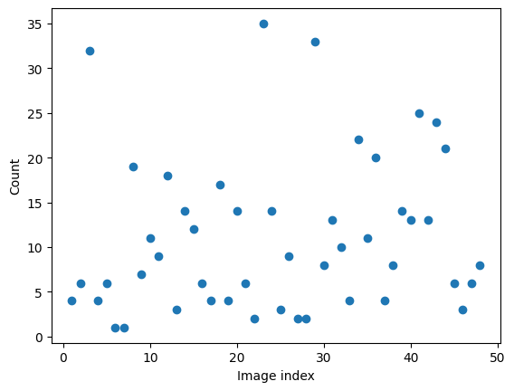
    


    

    


    
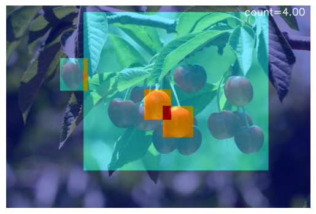
    


    
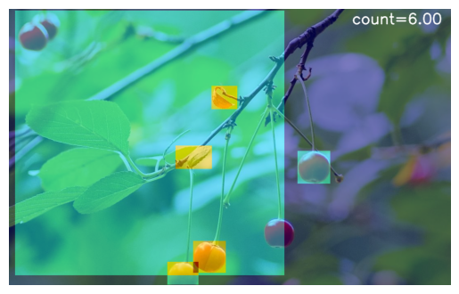
    


    
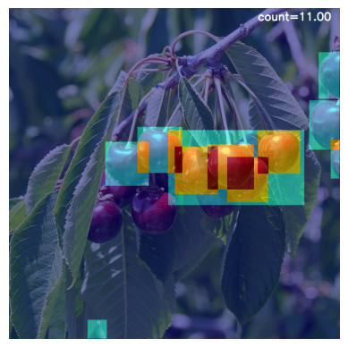
    


    
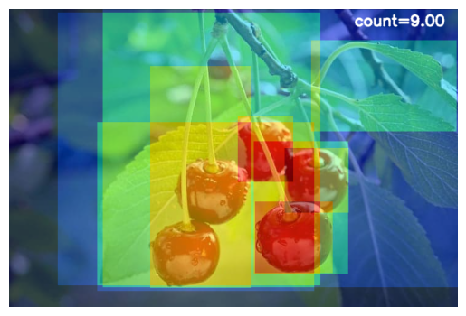
    


    
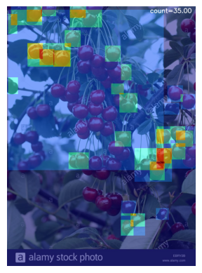
    


    

    


    
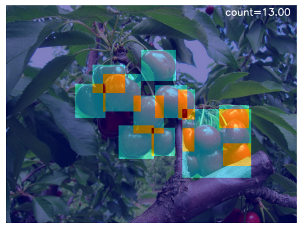
    


```python

```


```python

```


```python

```
